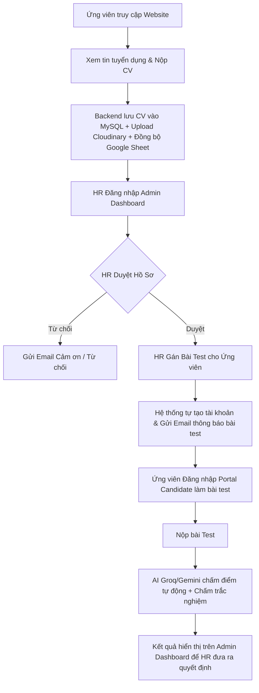

# 📘 BÁO CÁO KIẾN TRÚC & HƯỚNG DẪN VẬN HÀNH HỆ THỐNG VIỆT HƯƠNG RECRUITMENT

Tài liệu này cung cấp cái nhìn toàn diện về **ngôn ngữ, công nghệ, danh sách API, luồng vận hành sản phẩm, phần quan trọng nhất trong hệ thống** và **các lưu ý kỹ thuật cần thiết** đối với dự án **Việt Hương Recruitment**.

---

## 1. 🎯 Tổng Quan Sản Phẩm

**Việt Hương Recruitment** là hệ thống phần mềm quản lý tuyển dụng và tự động hóa đánh giá năng lực ứng viên dành cho **Việt Hương Ceramics**.

Sản phẩm bao gồm **2 phân hệ chính**:
1. **Trang cổng thông tin Tuyển dụng (Ứng viên)**: Cho phép xem thông tin doanh nghiệp, danh sách việc làm đang tuyển, nộp hồ sơ CV trực tuyến, nhận tài khoản làm bài test trắc nghiệm/tự luận/đánh máy trực tuyến.
2. **Trang Quản trị Tuyển dụng (HR & Super Admin)**: Cho phép nhà tuyển dụng đăng tin, quản lý danh sách hồ sơ ứng viên, tạo ngân hàng câu hỏi test, phân công bài test, xem AI hỗ trợ chấm bài tự luận và duyệt/từ chối ứng viên.

---

## 2. 💻 Ngôn Ngữ & Công Nghệ Sử Dụng

### A. Frontend (Giao diện Người dùng)
- **Ngôn ngữ**: JavaScript (ES6+ HTML5/CSS3).
- **Framework / Core**: **React 18** khởi tạo bằng **Vite**.
- **Điều hướng (Routing)**: **React Router DOM (v7)**.
- **Styling**: **Sass (SCSS)** / CSS Modules (Tạo hiệu ứng modern, mượt mà).
- **Thư viện Icon & SEO**: `lucide-react`, `react-helmet-async`.

### B. Backend (Máy chủ API)
- **Môi trường chạy**: **Node.js**.
- **Framework**: **Express.js (v5)**.
- **Xác thực & Mã hóa**: `jsonwebtoken` (JWT), `bcryptjs` (Mã hóa mật khẩu hash).
- **Upload File**: `multer`, `multer-storage-cloudinary`, `heic-convert`.

### C. Cơ Sở Dữ Liệu (Database)
- **Hệ quản trị CSDL**: **MySQL (v8.0 / v9.0)**.
- **Thư viện kết nối**: `mysql2/promise` (Sử dụng Connection Pool tối ưu hiệu năng).

### D. Tích Hợp Dịch Vụ Bên Ngoài (Third-Party Integrations)
1. **Cloudinary**: Lưu trữ đám mây hình ảnh banner, logo và file CV PDF/Word của ứng viên.
2. **Brevo (Sendinblue) / Gmail Nodemailer**: Gửi email tự động thông báo kết quả hồ sơ & gửi tài khoản/link làm bài test.
3. **Groq AI & Google Gemini AI (`@google/generative-ai`)**: Trí tuệ nhân tạo tự động đọc câu trả lời tự luận của ứng viên, đối chiếu đáp án và chấm điểm/nhận xét năng lực.
4. **Google Drive & Google Sheets API**: Tự động lưu file CV vào thư mục Google Drive và đồng bộ dữ liệu ứng viên ra Google Sheet quản lý chung.

---

## 3. 🔄 Luồng Hoạt Động & Quy Trình Sản Phẩm

### Chi tiết 2 quy trình vận hành:

#### 1. Quy trình Ứng viên (Candidate Flow):
1. Truy cập `http://localhost:5173/tuyen-dung`.
2. Chọn công việc ➔ Nhấn **Nộp Hồ Sơ** ➔ Điền thông tin và đính kèm CV file.
3. Nhận email thông báo nộp CV thành công.
4. Khi HR duyệt làm test, nhận email chứa link & tài khoản đăng nhập.
5. Truy cập `http://localhost:5173/candidate` làm bài test (Trắc nghiệm có đếm ngược thời gian, Tự luận, hoặc Kiểm tra tốc độ đánh máy wpm).
6. Nộp bài ➔ Xem kết quả tức thì.

#### 2. Quy trình Nhà Tuyển Dụng (HR / Super Admin Flow):
1. Truy cập `http://localhost:5173/admin` ➔ Đăng nhập bằng tài khoản `admin` / `admin123`.
2. **Đăng tin việc làm**: Quản lý các vị trí cần tuyển dụng.
3. **Quản lý Ứng viên**: Xem toàn bộ CV đã nộp, tải CV về xem, đổi trạng thái (`pending`, `passed`, `failed`, `rejected`).
4. **Tạo Bài Test**: Định nghĩa ngân hàng đề thi (Thời gian làm bài, danh sách câu hỏi trắc nghiệm/tự luận).
5. **Gán bài test & Xem điểm AI**: Phân bài test cho ứng viên, hệ thống AI sẽ tự động trả lời lý do chấm điểm đối với câu tự luận.

---

## 4. 🔗 Danh Sách Các Route API Chính (`http://localhost:5001/api`)

| Phân hệ | Phương thức | Endpoint API | Chức năng chính |
| :--- | :--- | :--- | :--- |
| **Auth** | `POST` | `/api/auth/login` | Đăng nhập Admin / HR |
| **Auth** | `POST` | `/api/auth/candidate/login` | Đăng nhập dành cho Ứng viên |
| **Auth** | `GET` | `/api/auth/users` | Lấy danh sách tài khoản Admin |
| **Jobs** | `GET` | `/api/jobs` | Lấy danh sách việc làm tuyển dụng |
| **Jobs** | `POST` | `/api/jobs` | Tạo việc làm mới (Cần Token HR) |
| **Jobs** | `PUT/DELETE` | `/api/jobs/:id` | Sửa hoặc xóa việc làm tuyển dụng |
| **Applications** | `GET` | `/api/applications` | Lấy toàn bộ danh sách CV đã nộp |
| **Applications** | `POST` | `/api/applications` | Nộp hồ sơ ứng tuyển mới (Form + File CV) |
| **Applications** | `PUT` | `/api/applications/:id/status` | Đổi trạng thái ứng viên (`passed`, `failed`,...) |
| **Tests** | `GET/POST` | `/api/tests` | Quản lý ngân hàng đề thi bài test |
| **Tests** | `POST` | `/api/tests/assign` | Gán bài test cho ứng viên & Gửi Email |
| **Grading** | `POST` | `/api/grading/submit` | Nộp bài test & AI chấm điểm tự động |

---

## 5. ⭐ Phần Nào Là Quan Trọng Nhất Trong Hệ Thống?

Phần quan trọng nhất của toàn bộ hệ thống này là **Trục Quản Lý Hồ Sơ & Đánh Giá Ứng Viên (Application & Test Evaluation Pipeline)**:

### Tại sao phần này quan trọng nhất?
1. **Trái tim dữ liệu (`applications` & `test_assignments`)**: Tất cả các tính năng khác (Tin tuyển dụng, Bài test, AI, Email) đều xoay quanh việc xử lý và chuyển trạng thái cho một ứng viên.
2. **Khả năng tự động hóa bằng AI (`grading.js`)**: Giúp HR tiết kiệm 80% thời gian nhờ việc AI tự động chấm bài tự luận và xếp hạng năng lực ứng viên ngay sau khi ứng viên nộp bài.
3. **Phân quyền Bảo mật JWT (`auth.js`)**: Đảm bảo ứng viên chỉ xem và làm đúng bài test được giao, trong khi HR và Super Admin có đúng thẩm quyền để quản lý dữ liệu nhạy cảm.

---

## 6. ⚠️ Các Lưu Ý Quan Trọng Khi Phát Triển & Bảo Trì

> [!WARNING]
> **1. Xung đột Port 5000 trên macOS:**
> Trên các dòng máy Mac (macOS Monterey trở lên), cổng `5000` bị chiếm mặc định bởi dịch vụ **AirPlay Receiver (AirTunes)**. Vì vậy, Backend bắt buộc phải chạy ở cổng `5001` (hoặc cổng khác `5000`) và Frontend `.env` phải trỏ đúng `VITE_API_URL=http://localhost:5001/api`.

> [!IMPORTANT]
> **2. Mã hóa dữ liệu SQL (UTF-8 vs UTF-16LE):**
> File dữ liệu mẫu ban đầu `crm_db.sql` được xuất ở định dạng `UTF-16LE`. Khi nạp vào MySQL bằng dòng lệnh CLI, cần chuyển đổi sang `UTF-8` (file `crm_db_utf8.sql`) để tránh lỗi ký tự `ASCII \0`.

> [!TIP]
> **3. Quản lý Biến Môi Trường (`.env`):**
> File `Backend/.env` chứa các API Key quan trọng (Cloudinary, Brevo, Groq, Google Service Account). Khi đưa lên máy chủ thật (Production/Render/VPS), cần đảm bảo các Key này còn hạn ngạch sử dụng.

> [!NOTE]
> **4. Tài khoản Admin mặc định:**
> Khi CSDL chưa có dữ liệu admin, khi Backend chạy hàm `initDB()`, hệ thống sẽ tự động khởi tạo tài khoản `admin` / `admin123` với vai trò `superadmin`. Sau khi bàn giao, nên đổi mật khẩu tài khoản này tại giao diện `/admin/users`.
